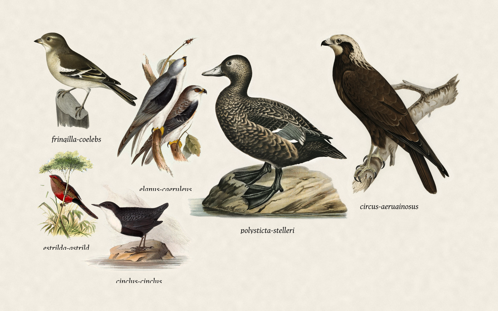

# Bird screensaver

A native Windows screensaver in the spirit of [Fugleramme](https://github.com/arnegiacomo/fugleramme): it listens on a microphone, identifies birds locally with [BirdNET](https://birdnet.cornell.edu/), and packs each species onto a sheet of paper using the same hand-cut 1800s plates.



C# and WPF. No Python, no cloud. The classifier is an ONNX model running in-process. Nothing leaves the PC.

Coverage is strongest for northern and western Europe, same as the plates. Species without a plate are left off the page.

BirdNET models are for personal, non-commercial use.

## What you need

- Windows 10 or 11
- [.NET 9 SDK](https://dotnet.microsoft.com/download)
- Git (to fetch plates)
- A microphone, unless you use demo mode
- About 150 MB for a regional BirdNET model, plus the plates

## Build

```bash
dotnet test
dotnet run --project src/BirdScreensaver -- --window --demo
```

`--demo` rotates species that have artwork, so you can work the collage without a mic.

One still:

```bash
dotnet run --project src/BirdScreensaver -- --preview out.png --demo
```

## First-time setup

```bash
dotnet run --project src/BirdScreensaver -- fetch-assets
dotnet run --project src/BirdScreensaver -- configure
```

The settings dialog lets you pick a microphone, a BirdNET region (Western Palearctic by default), and download the model. Then:

```bash
dotnet run --project src/BirdScreensaver -- --window
dotnet run --project src/BirdScreensaver -- install
```

`install` registers `BirdScreensaver.scr` from `%LOCALAPPDATA%\BirdScreensaver`. You can also pick it under Settings > Personalisation > Lock screen > Screen saver.

Windows starts it with `/s`, opens configure with `/c`, and embeds a tiny preview with `/p`.

## Installer

```bash
./installer/package.sh
```

That publishes a self-contained win-x64 build (plates included if you have fetched them; the BirdNET model is still downloaded later) and writes `dist/BirdScreensaver-0.1.0-win-x64.msi`. It installs per-user under `%LOCALAPPDATA%\BirdScreensaver` and can set the screensaver. No admin prompt.

## How it works

1. NAudio records from the chosen microphone.
2. A 5-second slice at 32 kHz is scored by BirdNET v3.0 (ONNX).
3. Species above the confidence threshold stay on the page for the lookback window.
4. The collage packs them largest-first from the centre, sized by real body mass, on textured paper.

An empty window shows a bare perch.

## Settings

Stored in `%APPDATA%\BirdScreensaver\settings.json`.

| Field | Default | Meaning |
| --- | --- | --- |
| `microphone` | system default | Windows capture device |
| `region` | `western-palearctic` | Which BirdNET slice to download |
| `confidence` | `0.65` | Minimum score |
| `lookbackMinutes` | `30` | How long a bird stays after last heard |
| `maxBirds` | `0` | Cap; `0` means no cap |
| `showNames` | `true` | Scientific names under the birds |
| `demo` | `false` | Rotate plates without a microphone |

Artwork and models are fetched on demand. They are not in this repository.

## License

Code is MIT. Plates are CC BY-SA 4.0 from Fugleramme. BirdNET models follow their own terms (personal use). See [LICENSE](LICENSE) and [assets/ATTRIBUTION.md](assets/ATTRIBUTION.md).
